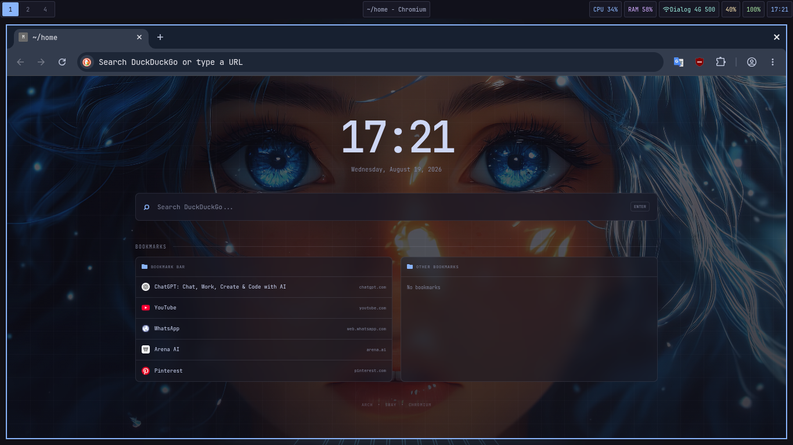

## Minimal Chromium Homepage + BookMarks + Live Wallpaper

A minimal dark Chromium New Tab homepage setup.

### Preview

<p align="center">
  
</p>

## Features

* DuckDuckGo search
* Live clock and date
* Automatic Chromium bookmarks
* Bookmark Bar and Other Bookmarks separated
* Website favicon icons
* Small, minimal UI
* Dark Sway-style theme
* Optional live wallpaper

## Files

```text
chromium-homepage/
├── index.html
├── style.css
├── script.js
├── manifest.json
├── screenshot.png
├── wallpaper.mp4
└── README.md
```

`wallpaper.mp4` is optional.

## Install

Clone the repository:

```bash
git clone https://github.com/YOUR-USERNAME/chromium-homepage.git
cd chromium-homepage
```

Create the Chromium extension directory:

```bash
mkdir -p ~/.config/chromium/my-homepage
cp index.html style.css script.js manifest.json ~/.config/chromium/my-homepage/
```

For the live wallpaper:

```bash
cp wallpaper.mp4 ~/.config/chromium/my-homepage/
```

Open Chromium:

```text
chrome://extensions
```

Enable **Developer mode** → **Load unpacked** → select:

```text
~/.config/chromium/my-homepage
```

Press `Ctrl + T` to open the custom homepage.

## Bookmarks

The extension uses Chromium's bookmarks permission to automatically display:

* Bookmark Bar
* Other Bookmarks
* Bookmark folders
* Website favicons

## Live Wallpaper

Put a video named:

```text
wallpaper.mp4
```

inside the extension folder.


For best Chromium compatibility, use H.264 MP4:
if you use your Video first convert it: or use H.264 MP4

convert: (optional)
```bash
ffmpeg -i input.mp4 \
  -c:v libx264 \
  -pix_fmt yuv420p \
  -movflags +faststart \
  wallpaper.mp4
```

## Theme

The homepage uses:

```text
Background: #1e1e2e
Accent:     #89b4fa
Font:       JetBrains Mono
```

## Requirements

* Chromium
* Chromium extension support
* FFmpeg — optional for wallpaper conversion

